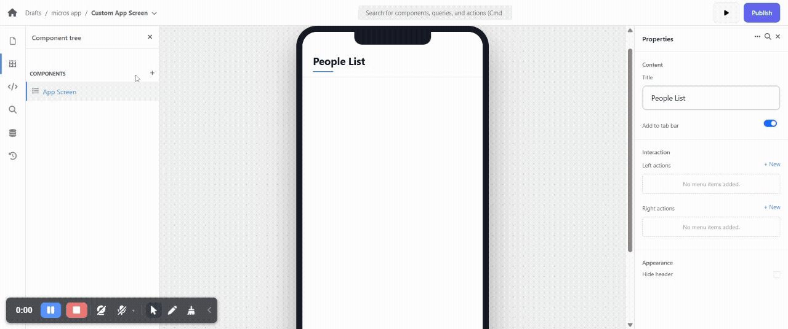
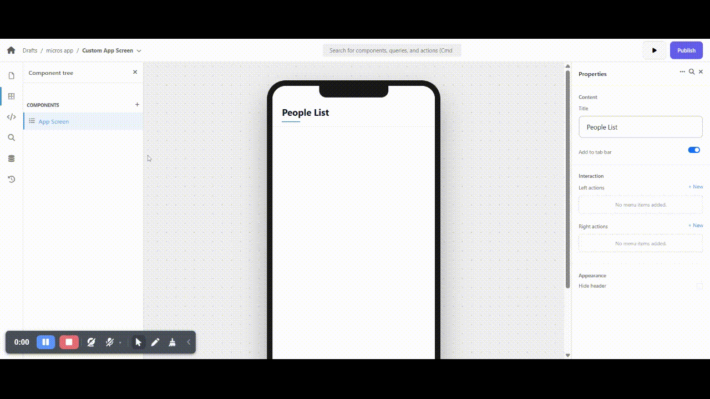
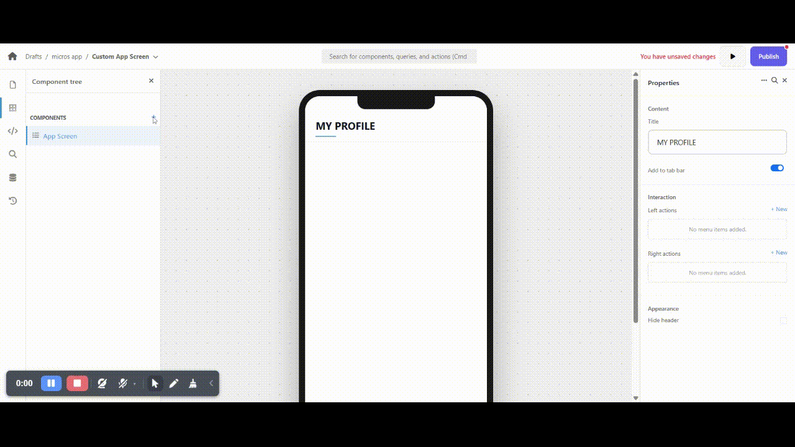

# Component Catalogue

Mix and match components inside each section's `components[]` array. Every component defines a `type`, `props`, and optional `data` binding. Below are the most common building blocks.

## CardImage

Display content in visually rich card layouts with images, text, and customizable styling.

```json
{
  "type": "CardImage",
  "props": {
    "imageUrl": "https://example.com/product.jpg",
    "title": "Premium Headphones",
    "body": "High-quality wireless headphones with noise cancellation",
    "caption": "$299.99",
    "imagePosition": "top",
    "alignment": "center",
    "imageSize": 200,
    "cardElevation": 6,
    "borderRadius": 16,
    "titleStyle": {
      "fontSize": 20,
      "fontWeight": "bold",
      "color": "#1a1a1a"
    },
    "bodyStyle": {
      "fontSize": 14,
      "color": "#666666"
    },
    "captionStyle": {
      "fontSize": 18,
      "fontWeight": "bold",
      "color": "#2196F3"
    }
  }
}
```

**Key Properties**

- `imageUrl` – URL of the image to display (supports `@state`, `@datasource`, `@item` bindings)
- `title`, `body`, `caption` – text content with independent styling
- `imagePosition` – `"top"`, `"bottom"`, `"left"`, or `"right"`
- `imageFit` – `"cover"` (fills space), `"contain"` (fits fully), or `"fill"` (stretches)
- `imageSize` – height in pixels for full-width images or width/height for square images
- `alignment` – `"left"`, `"center"`, or `"right"` for text alignment
- `padding` – number for uniform padding or object `{ left, right, top, bottom }`
- `cardColor`, `cardElevation`, `borderRadius` – visual card styling

**Multi-Card Grid**

```json
{
  "type": "CardImage",
  "props": {
    "cardsPerRow": 2,
    "spacing": 16,
    "cards": [
      {
        "imageUrl": "https://example.com/product1.jpg",
        "title": "Product 1",
        "body": "Description",
        "caption": "$49.99"
      },
      {
        "imageUrl": "https://example.com/product2.jpg",
        "title": "Product 2",
        "body": "Description",
        "caption": "$59.99"
      }
    ]
  }
}
```

**Tips**

- Use `imageFit: "cover"` for consistent card sizes in grids
- Keep titles concise (1-2 lines) for better scannability
- Leverage `titleStyle`, `bodyStyle`, `captionStyle` for typography control
- Position images `"left"` or `"right"` for profile/contact cards
- Use `cardsPerRow: 2` for product grids on mobile; keep spacing 12-16px
- Perfect for product listings, user profiles, blog posts, team members, and portfolio items

## CustomCard

A highly customizable card component with flexible headers, borders, and styling options. Extends the standard Material Card with advanced configuration for dynamic UI rendering.

```json
{
  "type": "CustomCard",
  "props": {
    "title": "Sales Summary",
    "elevation": 6,
    "color": "#F5F5F5",
    "borderColor": "#2196F3",
    "borderWidth": 2,
    "borderRadius": 16,
    "titleColor": "#2196F3",
    "titleSize": 20,
    "titleWeight": "bold",
    "padding": 20,
    "margin": 12,
    "child": {
      "type": "Text",
      "props": {
        "text": "Total Revenue: $45,000"
      }
    }
  }
}
```

**Key Properties**

- `title` – text title displayed at the top (only shown if `header` is null)
- `header` – custom widget for the card header (takes precedence over `title`)
- `elevation` – card shadow depth (default: 4.0; range 0-24)
- `color` – background color in hex format (`#RRGGBB` or `#AARRGGBB`)
- `shadowColor` – shadow color in hex format
- `borderColor`, `borderWidth`, `borderRadius` – border styling
- `titleColor`, `titleSize`, `titleWeight` – title text styling
- `padding` – internal content padding (number or object: `{ "left": 16, "top": 8, "right": 16, "bottom": 8 }`)
- `margin` – external card spacing (same format as padding)
- `child` – main content widget (required)

**Custom Header**

```json
{
  "type": "CustomCard",
  "props": {
    "elevation": 4,
    "borderRadius": 12,
    "padding": 16,
    "header": {
      "type": "Row",
      "props": {
        "children": [
          {
            "type": "Icon",
            "props": { "icon": "analytics", "color": "#4CAF50" }
          },
          {
            "type": "Text",
            "props": { "text": "Analytics Dashboard" }
          }
        ]
      }
    },
    "child": {
      "type": "Column",
      "props": {
        "children": [
          {
            "type": "Text",
            "props": { "text": "Page Views: 1,234" }
          },
          {
            "type": "Text",
            "props": { "text": "Active Users: 89" }
          }
        ]
      }
    }
  }
}
```

**Title Styling**

```json
{
  "type": "CustomCard",
  "props": {
    "title": "Important Notice",
    "titleColor": "#D32F2F",
    "titleSize": 18,
    "titleWeight": "w600",
    "color": "#FFEBEE",
    "borderColor": "#D32F2F",
    "borderWidth": 1.5,
    "elevation": 3,
    "child": {
      "type": "Text",
      "props": {
        "text": "Your attention is required"
      }
    }
  }
}
```

**Tips**

- Use `title` for simple text headers; use `header` for complex layouts with icons/buttons
- `header` takes precedence over `title` if both are provided
- Keep elevation between 0-8 for most use cases; higher = more prominence
- Ensure sufficient color contrast between background and text for accessibility
- Use hex color formats: `#RGB`, `#RRGGBB`, or `#AARRGGBB` for transparency
- Font weights support: `"normal"`, `"bold"`, `"w100"` through `"w900"`
- Border requires both `borderWidth` > 0 and a valid `borderColor` to be visible
- Perfect for dashboards, info panels, settings sections, and content containers

## ExpandableCardList

Display data in expandable cards with search, pagination, and rich metadata. Each card shows summary information when collapsed and reveals all item fields in a key-value table when expanded.

```json
{
  "type": "ExpandableCardList",
  "props": {
    "itemTitle": "customer_name",
    "itemSubtitle": "date",
    "leadingKey": "id",
    "trailingKey": "net_amount",
    "headerChips": ["item_name", "horse_name", "qty", "mode_name"],
    "chipLabels": {
      "item_name": "Item",
      "horse_name": "Horse",
      "qty": "Qty",
      "mode_name": "Payment"
    }
  },
  "data": { "source": "orders" }
}
```

**Key Properties**

- `itemTitle` – field name for card's main title (default: `"title"`)
- `itemSubtitle` – field name for card's subtitle (default: `"subtitle"`)
- `leadingKey` – field for leading avatar/indicator (circular badge on left)
- `trailingKey` – field for trailing badge/chip (colored chip on right)
- `headerChips` – array of field names to display as chips below subtitle
- `chipLabels` – custom labels for chip fields (maps field names to display text)

**Search Integration**

```json
{
  "type": "ExpandableCardList",
  "props": {
    "itemTitle": "name",
    "itemSubtitle": "breed",
    "searchStateKey": "horseSearch",
    "searchFields": ["owner", "trainer", "notes"],
    "minSearchLength": 2,
    "emptySearchMessage": "No horses match your search"
  },
  "data": { "source": "horses" }
}
```

- `searchStateKey` – state key containing search query (pair with `SearchBar` using same key)
- `searchFields` – additional fields to search (auto-searches title, subtitle, leading, trailing, chips)
- `minSearchLength` – minimum characters before filtering activates (default: 3)
- `scrollToTopOnSearch` – auto-scroll to top when search changes (default: true)

**Pagination**

```json
{
  "type": "ExpandableCardList",
  "props": {
    "manualPagination": true,
    "pageSize": 25,
    "autoLoadMoreOnScroll": true,
    "manualKey": "orders_pagination"
  },
  "data": { "source": "orders" }
}
```

- `manualPagination` – enable client-side pagination (default: true)
- `pageSize` – items per page (default: 50)
- `autoLoadMoreOnScroll` – load more when scrolling near bottom (default: true)
- `manualKey` – unique ID for pagination state (auto-generated if omitted)

**Action Buttons**

```json
{
  "type": "ExpandableCardList",
  "props": {
    "itemTitle": "name",
    "actionButton": {
      "text": "View Details",
      "icon": "arrow_forward",
      "visibleKey": "canEdit",
      "action": {
        "type": "openSchema",
        "url": "/horse-details",
        "initialState": { "horseId": "@item.id" }
      }
    }
  },
  "data": { "source": "horses" }
}
```

- `actionButton.text` – static button label (or use `labelKey` for dynamic label from item field)
- `actionButton.icon` – Material icon name (`send`, `edit`, `save`, etc.)
- `actionButton.visible` – static visibility (or use `visibleKey` for dynamic from item field)
- `actionButton.action` – action to execute when clicked

**Styling**

- `horizontalMargin` – horizontal margin for each card (default: 8)
- `verticalMargin` – vertical margin between cards (default: 4)

**Tips**

- Reserve chips for high-signal fields; too many chips reduce scannability
- Use `chipLabels` to translate backend keys into human-friendly text
- Pair with `SearchBar` component using matching `searchStateKey` for filtering
- Set unique `manualKey` when using multiple lists with the same data source
- All item fields display in alphabetical key-value table when card expands
- Use `visibleKey` on action buttons to show contextual actions per item
- Keep `pageSize` between 15-50 for optimal performance on mobile

## List

Display a simple vertical list of items with title, subtitle, and caption fields. Ideal for lightweight data presentation without the complexity of expandable cards.

```json
{
  "type": "list",
  "props": {
    "itemTitle": "text",
    "itemSubtitle": "description",
    "itemCaption": "caption",
    "top": 20,
    "left": 20,
    "hidden": false,
    "width": "Fill"
  },
  "data": {
    "items": [
      {
        "text": "Title 01",
        "description": "Description 01",
        "caption": "Caption 01"
      },
      {
        "text": "Title 02",
        "description": "Description 02",
        "caption": "Caption 02"
      }
    ]
  }
}
```

**Key Properties**

- `itemTitle` – field name for the main title of each list item (default: `"text"`)
- `itemSubtitle` – field name for the subtitle/description (default: `"description"`)
- `itemCaption` – field name for the caption/additional text (default: `"caption"`)
- `width` – width behavior: `"Fill"` (full width) or `"Wrap"` (fit content)
- `hidden` – visibility control: `true` or `false` (can be bound to state)
- `top` / `left` – positioning coordinates (in pixels)

**Dynamic Data Binding**

With data source:

```json
{
  "type": "list",
  "props": {
    "itemTitle": "name",
    "itemSubtitle": "email",
    "itemCaption": "role",
    "width": "Fill"
  },
  "data": {
    "source": "users"
  }
}
```

With state binding:

```json
{
  "type": "list",
  "props": {
    "itemTitle": "product_name",
    "itemSubtitle": "category",
    "itemCaption": "price",
    "width": "Fill"
  },
  "data": {
    "items": "@state.productList"
  }
}
```

**Common Patterns**

Contact list:

```json
{
  "type": "list",
  "props": {
    "itemTitle": "name",
    "itemSubtitle": "phone",
    "itemCaption": "email",
    "width": "Fill"
  },
  "data": {
    "source": "contacts"
  }
}
```

Task list:

```json
{
  "type": "list",
  "props": {
    "itemTitle": "task_name",
    "itemSubtitle": "assigned_to",
    "itemCaption": "due_date",
    "width": "Fill"
  },
  "data": {
    "source": "tasks"
  }
}
```

**Tips**

- Use for simple, read-only lists without interaction requirements
- For expandable details, use `ExpandableCardList` instead
- Keep list items concise; all three text fields (title, subtitle, caption) are displayed
- Bind to data sources or state for dynamic content
- Use `hidden` property with state bindings for conditional display
- Perfect for simple contact lists, menu items, notifications, or activity feeds

## SearchBar

Surface lightweight filtering in the same section as your list.

```json
{
  "type": "SearchBar",
  "props": {
    "stateKey": "schemeFilter",
    "placeholder": "Search schemes or codes",
    "leadingIcon": "search",
    "showClearButton": true,
    "filled": true,
    "borderRadius": 24,
    "minSearchLength": 3,
    "padding": { "left": 12, "right": 12, "top": 8, "bottom": 4 }
  }
}
```

- `stateKey` wires the input to `@state.<key>`; reuse that key inside `searchStateKey` on downstream lists.
- `minSearchLength` defers list filtering until the user types enough characters.
- `showClearButton`, `leadingIcon`, and `padding` keep the control accessible and inline with your layout density.

> Keep helper text short and let the empty state on your list explain what to try next.

## TabContainer

Organize content into switchable tabs with support for icons, badges, and swipe gestures.

```json
{
  "type": "tabContainer",
  "props": {
    "initialIndex": 0,
    "height": 400,
    "indicatorStyle": "pill",
    "tabs": [
      {
        "label": "Overview",
        "icon": "home",
        "content": {
          "type": "text",
          "props": {
            "text": "Welcome to the overview section!"
          }
        }
      },
      {
        "label": "Messages",
        "icon": "mail",
        "badge": "5",
        "badgeColor": "#FF5252",
        "badgeTextColor": "#FFFFFF",
        "content": {
          "type": "text",
          "props": {
            "text": "You have 5 new messages"
          }
        }
      },
      {
        "label": "Settings",
        "icon": "settings",
        "content": {
          "type": "column",
          "props": {
            "children": [
              {
                "type": "text",
                "props": {
                  "text": "Settings content here"
                }
              }
            ]
          }
        }
      }
    ]
  }
}
```

**Key Properties**

- `tabs` – array of tab objects; each requires `label` and `content`
- `initialIndex` – which tab to show initially (0-based; default: 0); bind to `@state` for programmatic control
- `height` – content area height in pixels (default: 360)
- `isScrollable` – enable horizontal scrolling for many tabs (default: false)
- `swipeable` – allow swipe gestures to change tabs (default: true); disable for step-by-step flows

**Tab Object**

Each tab supports:

- `label` – text shown on the tab button (required)
- `content` – widget/component to display when active (required)
- `icon` – Material icon name (`mail`, `notifications`, `person`, etc.)
- `badge` – small text badge (e.g., notification count) shown on tab
- `badgeColor` / `badgeTextColor` – badge styling (hex format)

**Indicator Styles**

Pill style (filled background):

```json
{
  "indicatorStyle": "pill",
  "indicatorRadius": 12,
  "indicatorColor": "#2196F3"
}
```

Underline style:

```json
{
  "indicatorStyle": "underline",
  "indicatorWeight": 3,
  "indicatorColor": "#2196F3"
}
```

**Color Customization**

- `backgroundColor` – tab bar background (hex format)
- `indicatorColor` – active tab indicator color
- `labelColor` – active tab text color
- `unselectedLabelColor` – inactive tab text color

**Padding & Spacing**

- `tabBarPadding` / `tabBarMargin` – spacing around the tab bar
- `labelPadding` – padding around each tab label
- `contentPadding` – padding inside the content area

Use number for uniform padding or object `{"horizontal": 16, "vertical": 8}` for granular control.

**Common Patterns**

Multi-step form:

```json
{
  "type": "tabContainer",
  "props": {
    "swipeable": false,
    "initialIndex": "@state.currentStep",
    "tabs": [
      {
        "label": "Step 1",
        "content": { "type": "textField", "props": { "name": "firstName" } }
      },
      {
        "label": "Step 2",
        "content": { "type": "textField", "props": { "name": "email" } }
      }
    ]
  }
}
```

Data categories with dynamic badges:

```json
{
  "isScrollable": true,
  "tabs": [
    {
      "label": "All",
      "badge": "@datasource.items.length",
      "content": {...}
    },
    {
      "label": "Active",
      "badge": "@datasource.activeItems.length",
      "content": {...}
    }
  ]
}
```

**Programmatic Tab Control**

Change tabs via state:

```json
{
  "type": "button",
  "props": {
    "text": "Go to Settings",
    "action": {
      "type": "setState",
      "key": "activeTab",
      "value": 2
    }
  }
}
```

Then bind `initialIndex`:

```json
{
  "type": "tabContainer",
  "props": {
    "initialIndex": "@state.activeTab",
    "tabs": [...]
  }
}
```

**Tips**

- Keep tab labels short (1-2 words) for scannability
- Use icons to help users quickly identify tab purposes
- Show badges for actionable items (notifications, unread counts)
- Enable `isScrollable` when you have 5+ tabs
- Disable `swipeable` for wizards/step-by-step flows where order matters
- Set appropriate `height` based on tallest content to avoid jarring jumps
- Tabs can contain any component—use `column` for complex layouts

## SummaryCard

Surface KPI-style values computed from state or data.


*Setting static options to summary cards

```json
{
  "type": "SummaryCard",
  "props": {
    "items": [
      { "label": "Amount", "value": "@state.amount" },
      { "label": "Net", "value": "@state.netAmount" }
    ]
  }
}
```

Place summary cards before forms so users see totals update live.

## Text

Display formatted text content with flexible alignment, styling, and Markdown support.

```json
{
  "type": "Text",
  "props": {
    "text": "👋 Hello",
    "mode": "Markdown",
    "width": "Fill",
    "align": "center",
    "hidden": false,
    "top": 20,
    "left": 20
  }
}
```

**Key Properties**

- `text` – the text content to display (supports emojis, special characters, and dynamic bindings like `@state` or `@datasource`)
- `mode` – rendering mode: `"Markdown"` for rich text formatting, or `"plain"` text (default)
- `width` – width behavior: `"Fill"` or `"Fixed"`
- `align` – text alignment: `"left"`, `"center"`, or `"right"`
- `hidden` – visibility control: `true` or `false` (can be bound to state for conditional display)
- `top` / `left` – positioning coordinates (in pixels)

**Common Patterns**

Dynamic text with state binding:

```json
{
  "type": "Text",
  "props": {
    "text": "Welcome, @state.username!",
    "mode": "Markdown",
    "align": "left"
  }
}
```

Conditional visibility:

```json
{
  "type": "Text",
  "props": {
    "text": "Error: Please fix the form",
    "align": "center",
    "hidden": "@state.isValid"
  }
}
```

**Tips**

- Use `mode: "Markdown"` to enable rich text formatting (bold, italic, links, etc.)
- Set `width: "Fill"` for full-width text blocks; use `"Wrap"` for inline text
- Leverage `hidden` property with state bindings for conditional rendering
- Combine with `Divider` to separate logical sections

## Divider

Horizontal line separator for visually dividing content sections.

```json
{
  "type": "Divider"
}
```

**Usage**

The Divider component creates a subtle horizontal line to separate logical groups of content without overwhelming the layout. It requires no additional properties and automatically spans the container width.

**Common Patterns**

Between form sections:

```json
{
  "components": [
    {
      "type": "Text",
      "props": { "text": "Personal Information" }
    },
    {
      "type": "TextField",
      "props": { "name": "firstName", "label": "First Name" }
    },
    {
      "type": "Divider"
    },
    {
      "type": "Text",
      "props": { "text": "Contact Details" }
    },
    {
      "type": "TextField",
      "props": { "name": "email", "label": "Email" }
    }
  ]
}
```

**Tips**

- Use sparingly to avoid visual clutter
- Best for separating major content sections or groupings
- Pairs well with section headings using `Text` component
- Automatically inherits theme colors for consistency

## TextField

The workhorse text input component that supports various keyboard types, validation, and onChange actions.

```json
{
  "type": "TextField",
  "props": {
    "name": "quantity",
    "label": "Quantity",
    "required": true,
    "keyboard": "number",
    "hint": "Enter quantity",
    "helper": "Minimum order: 1 unit",
    "prefixIcon": "shopping_cart",
    "filled": true,
    "onChange": [
      {
        "type": "calc",
        "target": "amount",
        "formula": "rate*quantity",
        "fixed": 2
      }
    ]
  }
}
```

**Key Properties**

- `name` – unique state key for the field value
- `label` – display label above the field
- `keyboard` – `"text"` (default), `"number"`, `"email"`, `"phone"`, `"url"` for optimized mobile keyboards
- `hint` – placeholder text shown when empty
- `helper` – helper text displayed below the field
- `prefixIcon` / `suffixIcon` – Material icons for visual context
- `required` – adds asterisk (\*) to label
- `readOnly` – makes field read-only
- `filled` – enables gray background fill (default: true)
- `onChange` – array of actions triggered when value changes

**Common Patterns**

Email input:

```json
{
  "name": "email",
  "label": "Email Address",
  "required": true,
  "keyboard": "email",
  "hint": "you@example.com",
  "prefixIcon": "email",
  "helper": "We'll never share your email"
}
```

Numeric calculation:

```json
{
  "name": "discount",
  "label": "Discount %",
  "keyboard": "number",
  "onChange": [
    {
      "type": "calc",
      "target": "netAmount",
      "formula": "amount - (amount*discount/100)",
      "fixed": 2
    }
  ]
}
```

**Tips**

- Always set appropriate `keyboard` type for better mobile UX
- Use `helper` text for format hints or constraints
- Keep `hint` text concise (under 30 characters)
- Mark computed/calculated fields as `readOnly: true`
- Leverage `onChange` for real-time calculations and validations

## RichTextEditor

The `RichTextEditor` component provides a flexible input field for creating formatted text using a markdown-like syntax. It includes a toolbar for common formatting options (bold, italic, underline) and outputs a string.

```json
{
  "type": "RichTextEditor",
  "props": {
    "name": "content",
    "label": "Description",
    "initialValue": "This is some **bold** and *italic* text."
  }
}
```

**Key Properties**

- `name` – (Required) A unique identifier for the state key where the rich text content will be stored.
- `label` – (Optional) The display label shown above the editor.
- `initialValue` – (Optional) The initial text content to populate the editor.

**Supported Formatting**

The editor supports the following markdown-like syntax:

- **Bold:** Wrap text with double asterisks (e.g., `**bold text**`)
- _Italic:_ Wrap text with single asterisks (e.g., `*italic text*`)
- <u>Underline:</u> Wrap text with double underscores (e.g., `__underlined text__`)

**Example Usage**

```json
{
  "type": "RichTextEditor",
  "props": {
    "name": "productDescription",
    "label": "Product Description",
    "initialValue": "This product is **innovative** and *highly recommended* for its __durability__."
  }
}
```

**Tips**

- The output of the `RichTextEditor` is a string with markdown-like syntax; ensure your display mechanism that can parse and render this format.
- Use the `label` prop to provide clear instructions to the user.
- The `name` prop is crucial for binding the editor's content to the application's state.

## ChipSelect

A flexible component that allows users to make single or multiple selections from a set of chips. It is ideal for filtering, tagging, or selecting options in a visually engaging way.


*Setting static options to chip select

```json
{
  "type": "chipselect",
  "props": {
    "name": "selectedFruits",
    "label": "Select your favorite fruits",
    "options": [
      {"label": "Apple", "value": "apple"},
      {"label": "Banana", "value": "banana"},
      {"label": "Orange", "value": "orange"}
    ],
    "initialValue": ["apple"],
    "maxSelection": 2,
    "selectedColor": "#FF5733"
  }
}
```

**Key Properties**

*   `name` - (Required) The state key to store the list of selected values.
*   `label` - (Optional) A text label displayed above the chips.
*   `options` - (Required) A list of objects, each with a `label` (display text) and a `value` (stored value).
*   `initialValue` - (Optional) A list of values to be pre-selected.
*   `maxSelection` - (Optional) The maximum number of chips that can be selected. If set to `1`, it behaves like a radio button group. If omitted, multiple selections are allowed.
*   `selectedColor` - (Optional) The background color of the selected chips (hex string).
*   `wrap` - (Optional) A boolean that determines if the chips should wrap to the next line. Defaults to `true`. If `false`, the chips are laid out in a single horizontally scrollable row.

## FloatingActionButton

A circular or extended button for a primary action in the application.

```json
{
  "type": "FloatingActionButton",
  "props": {
    "onPressed": { "type": "openSchema", "schema": "/full-path" },
    "icon": "add",
    "label": "Add Order",
    "backgroundColor": "#FFC107",
    "foregroundColor": "#000000",
    "elevation": 8.0
  }
}
```

**Key Properties**

- `onPressed` – action to perform when the button is pressed. Can be a navigation, submit, or other action.
- `icon` – the name of the Material icon to display.
- `label` – optional text to display, creating an extended FAB.
- `backgroundColor` – the background color of the button.
- `foregroundColor` – the color of the icon and label.
- `elevation` – the z-coordinate at which to place this button.

**Tips**

- Use a FAB for the most common or primary action on a screen.
- An extended FAB with a `label` can provide more context than an icon alone.
- Limit each screen to a single FAB to avoid visual clutter.

## FormGrid

The workhorse for multi-field forms. `columns` controls responsive layout; fields stack automatically on smaller breakpoints.

```json
{
  "type": "FormGrid",
  "props": {
    "columns": 2,
    "fields": [
      {
        "type": "Dropdown",
        "props": {
          "name": "item_id",
          "label": "Item",
          "required": true,
          "value": "@datasource.catalog.items[].id",
          "display_value": "@datasource.catalog.items[].name",
          "onChangeSet": { "rate": "@selected.rate" }
        },
        "data": { "source": "catalog" }
      },
      {
        "type": "TextField",
        "props": {
          "name": "quantity",
          "label": "Quantity",
          "keyboard": "number",
          "onChange": [
            {
              "type": "calc",
              "target": "amount",
              "formula": "rate*quantity",
              "fixed": 2
            },
            {
              "type": "calc",
              "target": "netAmount",
              "formula": "amount - (amount*discount/100)",
              "fixed": 2
            }
          ]
        }
      }
    ]
  }
}
```

**Field Guidelines**

- Use `prefixIcon` sparingly for quick recognition.
- Keep hints under 30 characters.
- Mark computed fields read-only and visually distinct (`filled: true`, muted text color).

### Field Types Cheat-Sheet

- `DateField` – native date picker wired to ISO strings; always pair with `required` when submissions depend on it.
- `TextField` – workhorse input; use the `keyboard` hint (`number`, `email`, etc.) to summon the right keypad on mobile.
- `Dropdown` – reference array data via `value`/`display_value` plus a `data.source`; lean on `onChangeSet` + `onChange` (see _Expressions & Actions_) to cascade derived values.
- `CheckBox` – boolean selection for agreements, consents, and independent toggles.
- `RadioGroup` – single selection from 2-7 mutually exclusive options; use `Dropdown` for longer lists.
- `Switch` – on/off toggle for settings with immediate effect; more prominent than checkboxes.

## Dropdown

Customizable select input with extensive data binding and styling options.

```json
{
  "type": "Dropdown",
  "props": {
    "name": "item_id",
    "label": "Item",
    "required": true,
    "hint": "Choose an item",
    "valueKey": "id",
    "labelKey": "name"
  },
  "data": { "source": "catalog" }
}
```

**Key Properties**

- `name` – state key for the selected value
- `valueKey` / `labelKey` – map data fields to option value/display (defaults: `"id"` / `"name"`)
- `value` / `display_value` – dynamic expressions for custom data mapping (e.g., `"@datasource.items[].product_id"`)
- `onChangeSet` – auto-populate state from selected item's fields
- `onChange` – trigger actions on selection (fetch dependent data, calculations, etc.)
- `filled` – enable background fill for modern appearance
- `borderRadius` – corner roundness (8-12 typical)
- `contentPadding` – inner spacing; use object for granular control
- `isDense` – reduce height for compact layouts
- `menuMaxHeight` – limit dropdown menu height (useful on mobile)

**Data Binding Methods**

Static options:

```json
{
  "name": "status",
  "label": "Status",
  "options": [
    { "value": "active", "label": "Active" },
    { "value": "inactive", "label": "Inactive" }
  ]
}
```

Data source with nested path:

```json
{
  "name": "trainer_id",
  "label": "Trainer",
  "data": {
    "source": "masterData",
    "path": "trainers"
  }
}
```

Custom expressions:

```json
{
  "name": "horse_id",
  "label": "Horse",
  "value": "@datasource.horses[].horse_id",
  "display_value": "@datasource.horses[].horse_name",
  "data": { "source": "horses" }
}
```

**Common Patterns**

Cascading dropdowns:

```json
{
  "name": "city_id",
  "label": "City",
  "onChange": [
    {
      "type": "fetch",
      "target": "districts",
      "url": "/api/districts?cityId={city_id}"
    },
    { "type": "setState", "values": { "district_id": null } }
  ],
  "data": { "source": "cities" }
}
```

Auto-populate related fields:

```json
{
  "name": "product_id",
  "label": "Product",
  "onChangeSet": {
    "price": "unit_price",
    "sku": "product_sku",
    "stock": "available_stock"
  },
  "data": { "source": "products" }
}
```

**Styling Tips**

- Match `fillColor` and `borderRadius` to your form theme
- Use `focusedBorderColor` to highlight active selection
- Set `labelWeight: "w500"` for emphasis
- Combine `filled: true` with light `fillColor` for Material Design 3 aesthetic
- Use `isDense: true` in compact layouts or mobile forms

**Tips**

- Use for 8+ options; prefer `RadioGroup` for 2-7 options
- Always provide `name` for state management
- Leverage `onChangeSet` to reduce manual `onChange` actions
- Set `menuMaxHeight` (e.g., 300) to prevent tall menus on mobile
- Use `hint` to guide users when no value is selected

## DateField

Native date and datetime picker with extensive customization options for forms and data entry. Supports date-only and date+time selection modes.

```json
{
  "type": "DateField",
  "props": {
    "name": "sale_date",
    "label": "Sale Date",
    "mode": "date",
    "required": true,
    "displayFormat": "us",
    "minDate": "today",
    "filled": true,
    "fillColor": "#F5F5F5",
    "borderRadius": 12,
    "prefixIcon": "event",
    "iconColor": "#6750A4",
    "primaryColor": "#6750A4",
    "helperText": "Select the sale date"
  }
}
```

*How to use date picker

**Key Properties**

- `mode` – picker type: `"date"` (default, date only) or `"datetime"` (date + time selection)
- `displayFormat` – visual presentation: `"default"` (yyyy-MM-dd), `"us"` (MM/dd/yyyy), `"eu"` (dd/MM/yyyy), `"long"` (December 15, 2025), `"short"` (Dec 15, 2025), or `"custom"` with `customFormat` pattern
- `customFormat` – custom format string when `displayFormat: "custom"` (e.g., `"dd-MMM-yyyy"`, `"MMMM d, yyyy 'at' h:mm a"`)
- `minDate` / `maxDate` – constrain selectable range; use `"today"` or ISO strings like `"2025-01-01"`
- `initialDate` – which date calendar opens to; use `"today"` or ISO string (defaults to current date)
- `yearRange` – years before/after current (default: 10); set to 100 for birth dates
- `filled` – enable background fill for modern appearance
- `fillColor` – background color for filled style (hex format)
- `borderStyle` – border type: `"outline"`, `"underline"`, or `"none"`
- `borderColor` / `focusedBorderColor` – border colors for default and focused states
- `borderRadius` – corner roundness (8-16 typical)
- `prefixIcon` / `suffixIcon` – Material icons (`event`, `calendar_today`, `date_range`, `schedule`, `access_time`)
- `iconColor` – icon tint color (hex format)
- `primaryColor` – theme color for calendar UI and selection highlights
- `headerBackgroundColor` / `headerTextColor` – calendar header styling
- `calendarHelpText` – help text shown in calendar dialog (default: "Select date")
- `cancelText` / `confirmText` – button labels in calendar dialog
- `onChange` – actions triggered when value changes

**Mode: Date vs DateTime**

Date mode (`mode: "date"`):

```json
{
  "type": "DateField",
  "props": {
    "name": "order_date",
    "label": "Order Date",
    "mode": "date",
    "displayFormat": "us"
  }
}
```

- Shows only date picker
- Stored value: `"2025-12-15"` (ISO date string)
- Display: `12/15/2025`

DateTime mode (`mode: "datetime"`):

```json
{
  "type": "DateField",
  "props": {
    "name": "appointment_time",
    "label": "Appointment",
    "mode": "datetime",
    "displayFormat": "long"
  }
}
```

- Shows date picker followed by time picker
- Stored value: `"2025-12-15T14:30:00.000Z"` (ISO datetime string)
- Display: `December 15, 2025 14:30`

**Display Format Options**

Quick reference with examples for date `2025-12-15` and time `14:30`:

- `"default"` → `2025-12-15` or `2025-12-15 14:30`
- `"us"` → `12/15/2025` or `12/15/2025 14:30`
- `"eu"` → `15/12/2025` or `15/12/2025 14:30`
- `"long"` → `December 15, 2025` or `December 15, 2025 14:30`
- `"short"` → `Dec 15, 2025` or `Dec 15, 2025 14:30`
- `"custom"` → your pattern (e.g., `"dd-MMM-yyyy"` → `15-Dec-2025`)

**Custom Format Tokens**

Date tokens: `yyyy` (year), `MMM` (short month), `MMMM` (full month), `MM` (month number), `dd` (day), `d` (day no zero)

Time tokens: `HH` (24h), `hh` (12h), `mm` (minute), `ss` (second), `a` (AM/PM)

Examples:

```json
{
  "displayFormat": "custom",
  "customFormat": "dd/MM/yyyy"
}
// Output: 15/12/2025

{
  "displayFormat": "custom",
  "customFormat": "MMMM d, yyyy 'at' h:mm a",
  "mode": "datetime"
}
// Output: December 15, 2025 at 2:30 PM
```

**Common Patterns**

Birth date (past only):

```json
{
  "name": "birth_date",
  "label": "Date of Birth",
  "required": true,
  "maxDate": "today",
  "yearRange": 100,
  "displayFormat": "long",
  "prefixIcon": "cake",
  "helperText": "Must be 18 or older"
}
```

Future appointments with time:

```json
{
  "name": "meeting_time",
  "label": "Meeting Time",
  "mode": "datetime",
  "required": true,
  "minDate": "today",
  "displayFormat": "custom",
  "customFormat": "MMM d, yyyy 'at' h:mm a",
  "prefixIcon": "schedule",
  "helperText": "Schedule your meeting"
}
```

Date range (start and end):

```json
{
  "type": "FormGrid",
  "props": {
    "columns": 2,
    "fields": [
      {
        "name": "start_date",
        "label": "Start Date",
        "required": true,
        "minDate": "today",
        "onChange": [
          {
            "type": "setState",
            "key": "end_date",
            "value": ""
          }
        ]
      },
      {
        "name": "end_date",
        "label": "End Date",
        "required": true,
        "minDate": "@state.start_date",
        "hint": "Must be after start date"
      }
    ]
  }
}
```

**Styling Examples**

Filled style with no border:

```json
{
  "filled": true,
  "fillColor": "#F5F5F5",
  "borderStyle": "none",
  "borderRadius": 12
}
```

Outline style with custom colors:

```json
{
  "borderStyle": "outline",
  "borderColor": "#2196F3",
  "focusedBorderColor": "#1976D2",
  "borderRadius": 12,
  "labelColor": "#1976D2"
}
```

Underline style:

```json
{
  "borderStyle": "underline",
  "borderColor": "#2196F3",
  "focusedBorderColor": "#1976D2"
}
```

**Advanced Patterns**

Dynamic constraints from state:

```json
{
  "name": "check_out",
  "label": "Check-out Date",
  "minDate": "@state.check_in",
  "helperText": "Must be after check-in"
}
```

Fetch data on date change:

```json
{
  "name": "booking_date",
  "label": "Booking Date",
  "onChange": [
    {
      "type": "fetchData",
      "source": "availableSlots",
      "url": "/api/slots?date=@state.booking_date"
    }
  ]
}
```

**Tips**

- Date values stored as ISO strings (`yyyy-MM-dd` for date, ISO 8601 for datetime) regardless of display format
- Use `mode: "datetime"` when you need both date and time selection
- Set appropriate `displayFormat` to match user locale/preference
- Use `"today"` for dynamic constraints instead of hardcoded dates
- Keep `yearRange` at 10 for recent dates; increase to 100+ for birth dates
- Use `helperText` to communicate date constraints and format expectations
- Match `primaryColor`, `iconColor`, and border colors to your theme
- Combine `filled: true` with light `fillColor` for Material Design 3 aesthetic
- Use `initialDate` to guide users to relevant date ranges
- Leverage `onChange` for cascading updates, validation, or fetching dependent data
- Common icons: `event`, `calendar_today`, `calendar_month`, `schedule`, `date_range`, `access_time`

## CheckBox

Multi-select checkbox group for choosing one or more options from a visible list.

```json
{
  "type": "Checkbox",
  "props": {
    "name": "payment_options",
    "label": "Payment Options",
    "required": false,
    "initialValue": ["include_tips"],
    "options": [
      { "label": "Include Tips in Net", "value": "include_tips" },
      { "label": "Notify Customer", "value": "notify_customer" },
      { "label": "Mark as Credit Sale", "value": "mark_credit" }
    ]
  }
}
```

**Key Properties**

- `name` – state key storing an array of selected values
- `label` – text label displayed above the checkbox group
- `options` – array of `{ "label": "...", "value": "..." }` objects
- `initialValue` – array of pre-selected values (e.g., `["option1", "option2"]`)
- `required` – adds asterisk (\*) to label for mandatory fields
- `onChange` – trigger actions when selections change

**Common Patterns**

User preferences:

```json
{
  "type": "Checkbox",
  "props": {
    "name": "notifications",
    "label": "Notification Preferences",
    "initialValue": ["email"],
    "options": [
      { "label": "Email Notifications", "value": "email" },
      { "label": "SMS Alerts", "value": "sms" },
      { "label": "Push Notifications", "value": "push" }
    ]
  }
}
```

Feature toggles:

```json
{
  "type": "Checkbox",
  "props": {
    "name": "features",
    "label": "Enable Features",
    "options": [
      { "label": "Auto-save", "value": "autosave" },
      { "label": "Dark Mode", "value": "dark_mode" },
      { "label": "Analytics", "value": "analytics" }
    ]
  }
}
```

**Tips**

- Selected values are stored as an array in `@state.<name>`
- Use when users can select multiple independent options
- For single selection, use `RadioGroup` instead
- Keep option count under 7 for better scannability
- Prefer `Switch` for settings with immediate effect; use `Checkbox` for form submissions

## RadioGroup

Mutually exclusive single selection from a visible list of options.

```json
{
  "type": "RadioGroup",
  "props": {
    "name": "paymentMethod",
    "label": "Payment Method",
    "required": true,
    "options": [
      { "value": "card", "label": "Credit Card" },
      { "value": "paypal", "label": "PayPal" },
      { "value": "bank", "label": "Bank Transfer" }
    ]
  }
}
```

**Key Properties**

- `name` – state key storing the selected option's `value`
- `options` – array of `{ "value": "...", "label": "..." }` objects
- `initialValue` – pre-select an option by its `value`
- `required` – mark as mandatory
- `data` – load options dynamically from a data source

**Dynamic Options**

```json
{
  "type": "RadioGroup",
  "data": {
    "source": "departments",
    "valueKey": "id",
    "labelKey": "name"
  },
  "props": {
    "name": "department",
    "label": "Select Department"
  }
}
```

**Common Patterns**

Size selection:

```json
{
  "name": "size",
  "label": "T-Shirt Size",
  "initialValue": "medium",
  "options": [
    { "value": "small", "label": "Small" },
    { "value": "medium", "label": "Medium" },
    { "value": "large", "label": "Large" }
  ]
}
```

Rating scale:

```json
{
  "name": "satisfaction",
  "label": "How satisfied are you?",
  "required": true,
  "options": [
    { "value": "5", "label": "Very Satisfied" },
    { "value": "4", "label": "Satisfied" },
    { "value": "3", "label": "Neutral" },
    { "value": "2", "label": "Dissatisfied" }
  ]
}
```

**Tips**

- Best for 2-7 options; use `Dropdown` for 8+ options
- Always mutually exclusive—only one selection allowed
- Vertical layout improves accessibility
- Use `onChange` to cascade related field updates

## Switch

Toggle control for on/off states with immediate visual feedback, ideal for settings.

```json
{
  "type": "Switch",
  "props": {
    "name": "notifications",
    "label": "Enable Notifications",
    "activeColor": "#4CAF50"
  }
}
```

**Key Properties**

- `name` – state key for the boolean value (`true`/`false`)
- `label` – text displayed next to the switch
- `activeColor` – hex color when toggled on (e.g., `"#4CAF50"`)
- `initialValue` – start in on/off state
- `onChange` – trigger actions on toggle

**Common Patterns**

Settings panel:

```json
{
  "type": "FormGrid",
  "props": {
    "columns": 1,
    "fields": [
      {
        "type": "Switch",
        "props": {
          "name": "darkMode",
          "label": "Dark Mode",
          "activeColor": "#2196F3"
        }
      },
      {
        "type": "Switch",
        "props": {
          "name": "autoSave",
          "label": "Auto-save Changes",
          "activeColor": "#2196F3"
        }
      },
      {
        "type": "Switch",
        "props": {
          "name": "soundEffects",
          "label": "Sound Effects",
          "activeColor": "#2196F3"
        }
      }
    ]
  }
}
```

With API sync:

```json
{
  "name": "betaFeatures",
  "label": "Beta Features",
  "activeColor": "#9C27B0",
  "onChange": [
    {
      "type": "submit",
      "url": "/api/user/preferences",
      "method": "PATCH",
      "body": { "betaFeatures": "@state.betaFeatures" }
    }
  ]
}
```

**Tips**

- Use for settings that take immediate effect
- More prominent than checkboxes—better for feature toggles
- Consistent `activeColor` creates visual hierarchy
- Prefer over `CheckBox` when the action is instant (not form-based)

## Button + Submit Action

```json
{
  "type": "Button",
  "props": {
    "text": "Submit",
    "icon": "send",
    "type": "Primary",
    "action": {
      "type": "submit",
      "url": "https://api.example.com/orders",
      "method": "POST",
      "body": {
        "date": "@state.date",
        "customer": "@state.customer_name",
        "item_id": "@state.item_id",
        "quantity": "@state.quantity",
        "amount": "@state.amount"
      },
      "onSuccess": [
        { "type": "snack", "message": "Order submitted" },
        {
          "type": "setState",
          "values": {
            "quantity": "",
            "discount": "",
            "amount": "",
            "netAmount": ""
          }
        }
      ]
    }
  }
}
```

Actions support composable side effects:

- `type` – button style: `"Primary"` OR `"Secondary"`
- `snack` – toast/snackbar notifications.
- `setState` – reset form fields or prime defaults.
- `navigate` – move to another section or screen.
